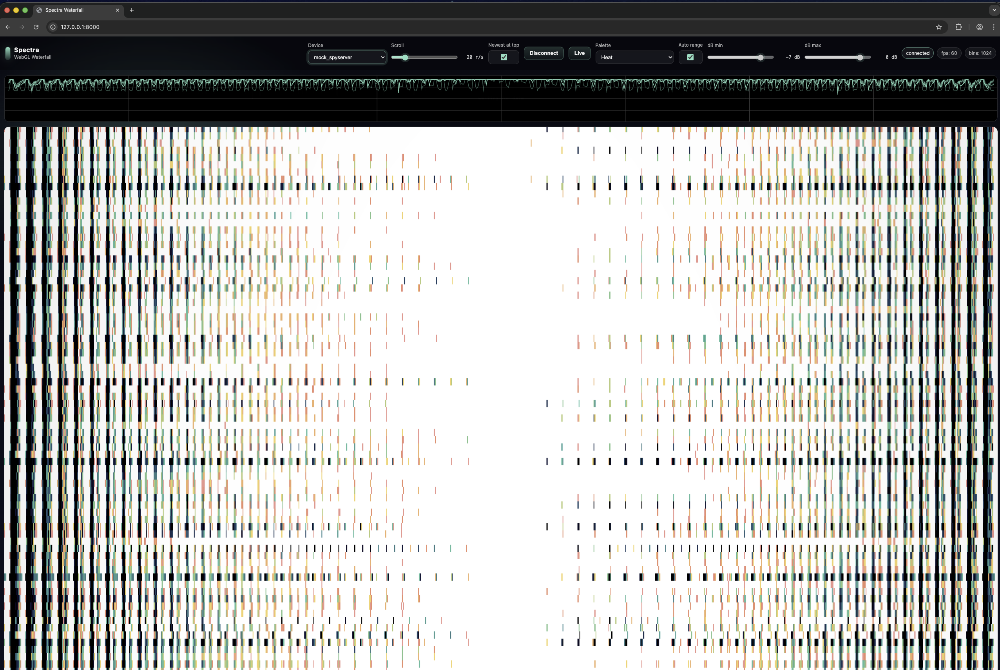

# Project Spectra

Active Development

[← Back to Projects](../projects)

---

## The Concept

Transform raw radio spectrum data into an actionable "Signal Census" through automated detection, ML classification, and distributed acquisition.

*Real-time signal detection showing frequency, bandwidth, modulation type, and classification confidence across the RF spectrum*

## Quick Facts

| | |
|---|---|
| **Status** | Active |
| **Language** | N/A |
| **Started** | 2026 |

---

---

[← Back to Projects](../projects) | [Development Philosophy](../development)
