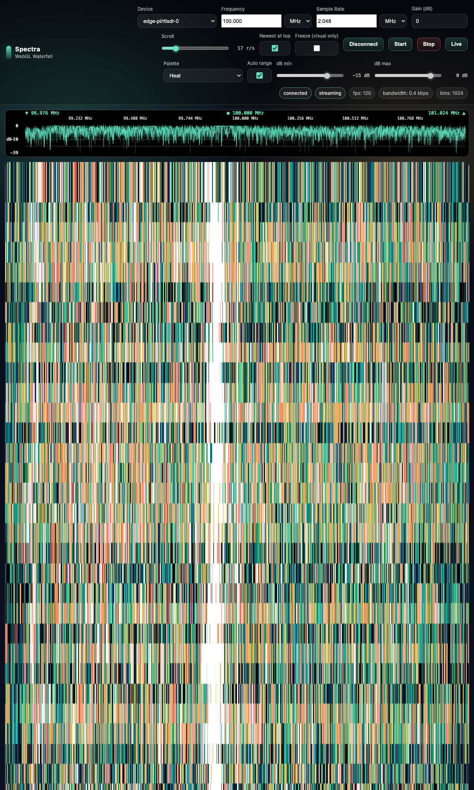

# Signal Processing & RF Ecosystem

Experimental projects exploring SDR spectrum monitoring and biometric signal processing.

---

## Software Defined Radio

### Passive Radar — KrakenSDR Multi-Beam System

Phase 2/4 (56%) · [Full Details →](projects/passive)

**What It Is:**
Building on open source passive radar implementations to track aircraft using KrakenSDR (5-channel coherent SDR) by analyzing reflections of existing FM radio transmissions.

**Current Status:** Phase 2 (Clean, stable foundation for reliable tracking)

**Tech Stack:** Python, numpy, scipy, KrakenSDR firmware, Rust (planned migration)

---

### Project Spectra — SDR Client

Active Development · [Full Details →](projects/signals)

**What It Is:**
An SDR client for spectrum monitoring and signal analysis using RTL-SDR and HackRF hardware.

**Features:**
- Wide-band scanning with RTL-SDR and HackRF
- Signal detection and classification
- Real-time waterfall display

**Current Status:** Active development

**Tech Stack:** Python, numpy, scipy, RTL-SDR, HackRF

---

### Wi-Fi Radar — Through-Wall Detection

Active Development · [Full Details →](projects/wifi-radar)

**What It Is:**
Using KrakenSDR for through-wall human detection via Wi-Fi signal phase analysis.

**Current Status:** Proof-of-concept detection working

**Tech Stack:** Rust, KrakenSDR

---

## Health & Biometrics

### HealthyPi Biometric Signal Processing

Experimental · [Full Details →](projects/healthypi)

**What It Is:**
Experimental signal processing using the [HealthyPi](https://www.crowdsupply.com/protocentral/healthypi-move) biometric hardware platform (developed by Protocentral) for ECG, PPG, and respiration analysis with NeuroKit2.

**Current Status:** Phase 6 (NATS integration + reconnection handling + tests)

**Tech Stack:** Python, NeuroKit2, numpy, scipy, NATS

---

## Open Source & Contributions

- **HealthyPi Ecosystem**: [github.com/sk2/healthypi](https://github.com/sk2/healthypi)
- **Project Spectra**: [github.com/sk2/spectra](https://github.com/sk2/spectra)
- **Passive Radar**: [github.com/sk2/passive-radar](https://github.com/sk2/passive-radar)
- **Wi-Fi Radar**: [github.com/sk2/wifi-radar](https://github.com/sk2/wifi-radar)

---

[← Back to Projects](projects) | [View CV](cv) | [Network Automation](network-automation) | [Data Analytics](data-analytics) | [Agentic Systems](agentic-systems)

