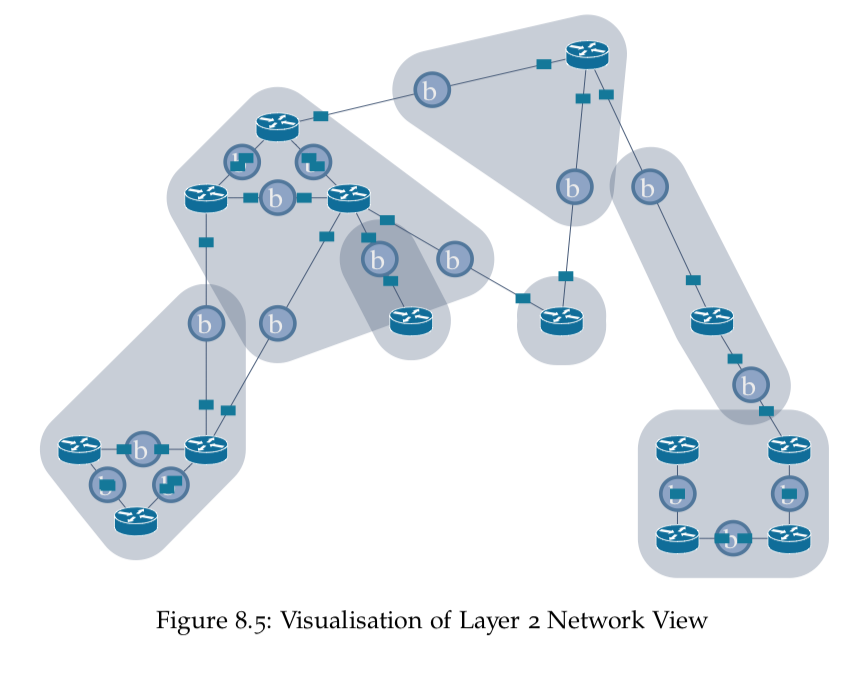

# PhD Thesis

I completed my PhD at the University of South Australia in January 2017.

For my thesis I looked at automatically building configurations for traditional IP networks from a simplified high-level description. This uses abstractions to compile the individual device configurations for a variety of platforms and protocols.

These abstractions could be used to build the data-stores used in emerging software automation approaches for managing traditional IP network equipment.

My work produced the AutoNetkit software which is [available](https://github.com/sk2/autonetkit) on GitHub. It is written in Python and used in the [VIRL](http://virl.cisco.com/) project at Cisco. I gave a talk on AutoNetkit at PyCon AU 2013, with a recording available on [YouTube](https://www.youtube.com/watch?v=EGK5jjyUBCQ).

A copy of my PHD thesis, Abstractions and Transformations for Automated Data Network Configuration, is available on the University of South Australia [website](http://search.ror.unisa.edu.au/record/9916123403601831) or here [Thesis](thesis.pdf).

Thank you to my Supervisors at the University of South Australia: A/Prof Kearney and Dr Wigley; and to the reviewers Prof Bonaventure and Prof Bergmann for their feedback.

## Abstract
*Modern computer networks have grown to become fundamental infrastructure, but the engineering process used to design and manage them lacks strong high-level abstractions and systematic design tooling.*

*They are typically managed by network engineers entering device configurations in a low-level vendor-specific syntax. The information in this low-level configuration must be consistent across the entire network, with the engineer responsible for converting of high-level network designs into device configurations. This makes configuration complex, time consuming and error-prone.  Recent techniques such as Software-Defined Networking or network programmability relieve some of this burden, but are still in development, and often require upgrades of existing infrastructure and retraining of engineering staff, and can vary between vendors.*

*In this thesis we present an approach to automate the process of generating low-level device configurations for existing network deployments, from a high-level specification. We present a specification abstraction to capture high-level policy in a format which is compatible with current industry practice, and an approach to transform this to an intermediate network-wide configuration state representation. A second transformation step converts the intermediate representation into the low-level device configuration state appropriate for the target device, which is then assembled using simple templates. We show how this multi-stage compiler approach allows the expression of new high-level policies on different network topologies, variation of network designs and routing protocols, and generation of configurations for different target devices.*

*We have incorporated this approach into an open-source tool, AutoNetkit, which has been tested on a range of industry-derived network topologies. The test cases show that the approach is extensible to a wide range of protocols and devices, and scalable up to the a size comparable to the core devices of the European academic network. Valid configurations for over a thousand devices can be generated in seconds. AutoNetkit has also been used in peer-reviewed demonstrations and as a component in tools used by network engineers in industry.*

## Overview

The general idea is to capture high-level intent at the "whiteboard" level, transform this into a number of abstract network views (representing topologies), and then compile these to device descriptions. These descriptions can be rendered using simple templates or pushed directly using NETCONF.

## Selected Figures
Some figures from the thesis are below:

### Overview flowchart

### Network View Abstractions
 
 

### Design Functions
 

 
 

### Configuration Generation

### System Implementation
 

### Case Studies
  
 
   
   
   
### Future Workflows
   
  
